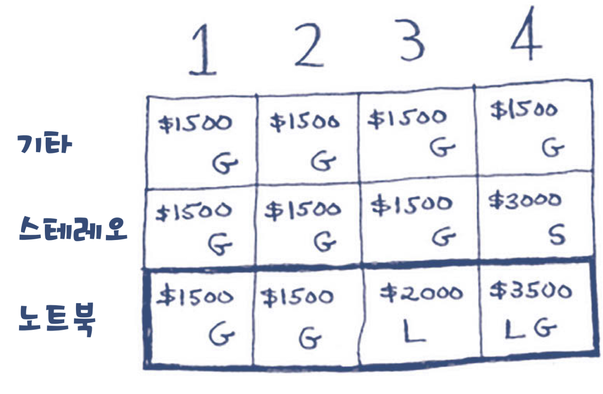
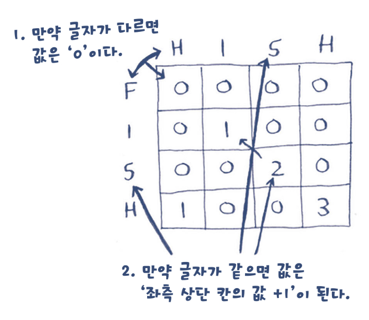

# 동적 프로그래밍
- dynamic
- 하위의 작은 문제를 풀고, 더 큰 문제를 풀어나가는 것
    - 단, 문제의 조건들은 의존적이면 안된다.

## 배낭 채우기

```java
public class KnapsackByDP {
    public static void main(String[] args) {
        int[] values = {60, 100, 120}; // => 1개 씩만 있다.
        int[] weights = {10, 20, 30};
        int capacity = 50;

        int maxValue = knapsack(weights, values, capacity);
        System.out.println("최대 가치: " + maxValue);
    }

    public static int knapsack(int[] weights, int[] values, int capacity) {
        // 종류만큼 진행된다
        int n = weights.length;
        // 최대공약수를 용량 단위로 하자
        int per = findGCD(findGCD(weights), capacity);

        // 용량 단위만큼 확인된다. 0 무게부터 시작하자
        int[][] dp = new int[n][capacity/per + 1];


        for (int i = 0; i < n; i++) {
            for (int j = 1; j <= capacity/per; j ++) {
                // 확인할 용량
                int w = (j) * per;

                // 최소값
                if (i == 0) {
                    dp[i][j] = weights[i] <= w
                            ? values[i]
                            : 0;
                } else {
                    dp[i][j] = weights[i] <= w
                            // 남는 무게를 채워줄 아이템을 찾는다
                            ? Math.max(values[i] + dp[i - 1][(w - weights[i])/per], dp[i - 1][j])
                            : dp[i - 1][j];
                }
            }
        }

        //
        for(int i = 0; i< dp.length; i++){
            for(int j =0; j<dp[i].length; j++){
                System.out.print(values[i]+":"+weights[i]+"/"+j*per+"=>"+dp[i][j]+" ");
            }
            System.out.println();
        }
        return dp[n - 1][capacity/per];
    }

    ////////////
    // 여러 개의 숫자의 최대공약수를 계산하는 함수
    public static int findGCD(int[] numbers) {
        if (numbers.length < 2) {
            throw new IllegalArgumentException("최소 두 개의 숫자가 필요합니다.");
        }

        int gcd = numbers[0];
        for (int i = 1; i < numbers.length; i++) {
            gcd = findGCD(gcd, numbers[i]);
        }

        return gcd;
    }
    // 두 수의 최대공약수(GCD)를 계산하는 함수
    public static int findGCD(int a, int b) {
        if (b == 0) {
            return a;
        }
        return findGCD(b, a % b);
    }
}
```

## 최장 공통 부분 문자열
- Longest Common Subsequence

```java
public class LCSByDP {
    public static void main(String[] args){
        String str1 = "hishi";
        String str2 = "fish";
        String str3 = "history";
        String str4 = "hyashins";

        System.out.println("최장 공통 부분 문자열: " + findLcs(str1, str2));
        System.out.println("최장 공통 부분 문자열: " + findLcs(str1, str3));
        System.out.println("최장 공통 부분 문자열: " + findLcs(str1, str4));
        
        // + 검색엔진이라면, 단어를 음운으로 그룹화시키지 않을까?
    }

    public static String findLcs(String str1, String str2){
        int m = str1.length();
        int n = str2.length();

        int[][] dp = new int[m + 1][n + 1];
        int maxLength = 0;  // 최대 부분 문자열의 길이
        int endIndex = 0;   // 최대 부분 문자열의 끝 인덱스

        for (int i = 1; i <= m; i++) {
            for (int j = 1; j <= n; j++) {
                if (str1.charAt(i - 1) == str2.charAt(j - 1)) {
                    dp[i][j] = dp[i - 1][j - 1] + 1;
                    // 최대 일치 문자열을 찾는다
                    if (dp[i][j] > maxLength) {
                        maxLength = dp[i][j];
                        endIndex = i - 1; // 현재 문자열의 끝 인덱스 저장
                    }
                } else {
                    dp[i][j] = 0;
                }
            }
        }

        if (maxLength == 0) {
            return ""; // 공통 부분 문자열이 없는 경우
        }

        // 최대 부분 문자열을 찾아서 반환
        return str1.substring(endIndex - maxLength + 1, endIndex + 1);
    }
}
```

